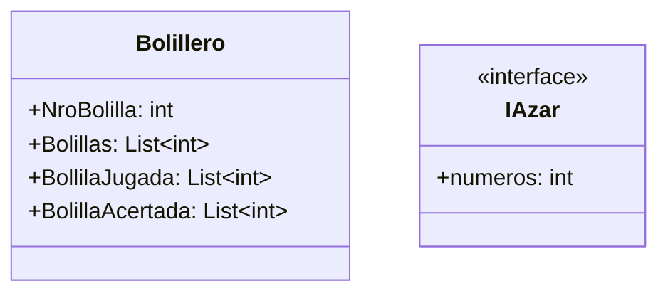

```mermaid

classDiagram

class Bolillero{
    +NroBolilla: int
    +Bolillas: List~int~
    +BollilaJugada: List~int~ 
    +BolillaAcertada: List~int~
}


class IAzar{
    <<interface>>
    +numeros: int
}

```