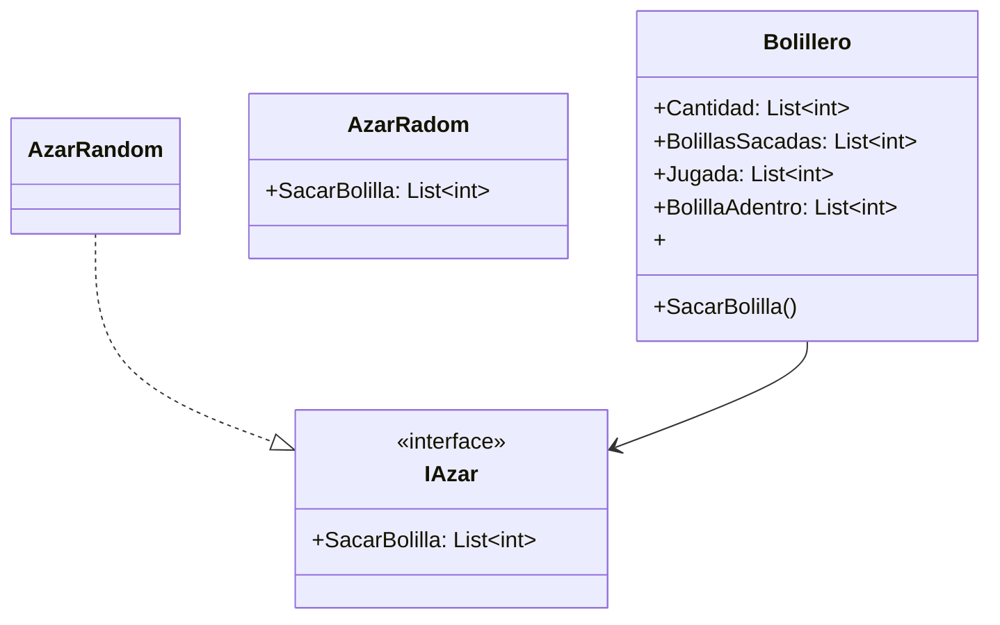

```mermaid

classDiagram

class Bolillero{
    +Cantidad: List~int~
    +BolillasSacadas: List~int~
    +Jugada: List~int~ 
    +BolillaAdentro: List~int~
    +
    +SacarBolilla()
}

class IAzar{
    <<interface>>
    +SacarBolilla: List~int~
}

class AzarRadom{
    +SacarBolilla: List~int~
}

AzarRandom ..|> IAzar 
Bolillero --> IAzar 

```